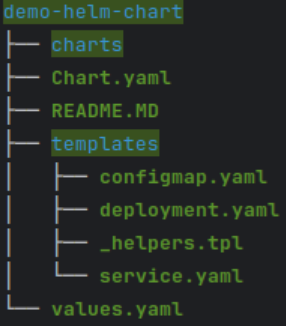

# PRE-REQUISITES
* Docker
* Minikube
* Kubctl
* Helm

# RUNNING STEPS

```bash
minikube start --driver=docker
```

```bash
eval $(minikube docker-env)
```
```bash
docker build -t demo-helm-app .
```
```bash
helm install demo-helm demo-helm-chart/
```
#### Retrieve the URL: http://$NODE_IP:$NODE_PORT
```bash
minikube ip
kubectl get service
minikube service demo-helm-chart-service --url
```
### Testing the application 
```bash
curl -v http://$NODE_IP:$NODE_PORT/test-helm
```

### Cleaning (Optional)
```bash
helm uninstall demo-helm
eval $(minikube docker-env -u)
minikube stop
```

# COMMANDS Used in the process

## Test With Docker
### Build
```bash
docker build -t demo-helm-app .
```
### Run
```bash
docker run --name demo-helm-app -p 8080:8080 demo-helm-app
```

## Minikube
### starts a Minikube Kubernetes cluster using Docker as the virtualization driver.
```bash
minikube start --driver=docker
```

### To the Docker commands interact with the Docker daemon inside Minikube cluster instead of the local machine's Docker daemon 
```bash
# before build the Docker image
eval $(minikube docker-env)
```
### To reset the Docker environment back to the local daemon 
```bash
eval $(minikube docker-env -u)
```

## Helm
### Create Helm Chart
```bash
helm create demo-helm-chart
tree demo-helm-chart
```


### [Here is a description of the Chart's Content](demo-helm-chart/README.MD)

### Install Helm Chart
```bash
helm install demo-helm demo-helm-chart/
```

## Retrieve the URL: http://$NODE_IP:$NODE_PORT
```bash
minikube ip
kubectl get service
minikube service demo-helm-chart-service --url
```
## Testing the application with curl request 
```bash
curl -v http://$NODE_IP:$NODE_PORT/test-helm
```

## Cleaning
```bash
helm uninstall demo-helm
eval $(minikube docker-env -u)
minikube stop
```
